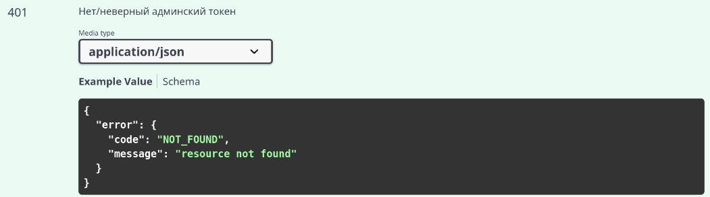
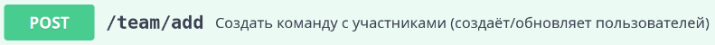

<h1 align="center">
  <strong>pr-review</strong>
</h1>
<p align="center">
  <a href="#быстрый-старт">Быстрый старт</a> •
  <a href="#вопросы">Вопросы</a> •
  <a href="#дополнительные-задания">Дополнительные задания</a>
</p>
<p align="center">
  <a href="https://github.com/Jacute/pr-review/actions"></a>
  <a href="https://codecov.io/gh/Jacute/pr-review"></a>
  <a href='https://badge.coveralls.io/github/Jacute/pr-review?branch=master'></a>
</p>

Сервис для назначения ревьюверов на PR.

[Задача](https://github.com/avito-tech/tech-internship/blob/main/Tech%20Internships/Backend/Backend-trainee-assignment-autumn-2025/Backend-trainee-assignment-autumn-2025.md)

## Быстрый старт

### Зависимости

- Docker
- Docker Compose
- Make

### Запуск

1. Настроить переменные окружения для базы данных [deploy/.db.env](./deploy/.db.env) и для сервиса [deploy/.env](./deploy/.env)
2. Запустить БД и сервис
```bash
make up
```

### Прочие команды

- Запуск e2e тестов - `make run-e2e-tests`
- Выключить сервис - `make down`
- Выключить сервис и очистить БД - `make clean`
- Сгенерировать сваггер - `make swagger`. Для этого необходимо установить утилиту swag (можно сделать командой `make install-swag`)

## Вопросы

### Должна ли быть аутентификация?

В задании **не прописана аутентификация**. В swagger она тоже не добавлена. Единственное её малейшее упоминание в swagger'е - в эндпоинте **POST /users/setIsActive**.


Но на проде хотелось бы видеть следующую реализацию в зависимости от того, как будет использоваться сервис:
1. **В сервис ходят из CI job**

При создании PR'а прокатывается job'а, которая делает запрос к данному сервису. Такие запросы должны проходить аутентификацию иначе любой сможет выполнять действия в сервисе.

Если мы имеем дело с Gitlab CI, то для этого есть [**ID TOKEN**](https://docs.gitlab.com/ci/secrets/id_token_authentication/).

В job'е это будет выглядеть вот так: `curl -v "http://192.168.0.51:1337" -H "Authorization: $ID_TOKEN"`.

Сервис же проверяет подпись токена через публичный ключ, который выдаёт gitlab при обращении на https://gitlab.com/oauth/discovery/keys.

Также необходимо дополнительно проверять поле "aud" в теле токена на соответствие сервису pr-review.

2. **В сервис ходят разработчики руками либо через какой-то интерфейс**

В таком случае необходимо использовать **JWT** и проверять его TTL (к примеру, одна неделя). Секрет для проверки подписи JWT необходимо хранить в **Vault**.

3. **На некоторые эндпоинты ходит CI, на некоторые разработчики**

В таком случае необходимо совместить два метода выше и в миддлварях на эндпоинтах для разработчиков проверять **JWT**, а на эндпоинтах для CI проверять **ID TOKEN**.

Так или иначе все эндпоинты должны быть под какой-либо аутентификацией.

**Как сделал я?**

Так как в самом задании нет упоминаний об аутентификации, я решил её не делать. К тому же перед сервисом может стоять Gateway, который валидирует токены. В таком случае дополнительная аутентификация не нужна, если у нас есть уверенность в том, что к сервису можно постучаться только через Gateway.

### Где хранить секреты?

В задании нет упоминания, где хранить секреты сервиса. У меня они хранятся в файлах .env, но на проде они должны храниться в Vault.

### Может ли один пользователь состоять в нескольких командах?

Если я правильно понял, то нет. Но в задании чётко это не сказано. Поэтому я решил сделать так, что у пользователя изменяется team_id при создании другой команды.

То есть если мы послали запрос POST /team/add с пользователем "user1", создав первую команду, и послали второй запрос, создав вторую команду с этим же пользователем, то пользователь "user1" окажется во второй команде.

### Обновление участников команды

В описании эндпоинта POST /team/add указано следующее:


Не совсем понятно, что значит "обновляет пользователей".

Я посчитал правильным реализовать так:
1. Создаём команду. Если команда с таким именем уже есть, то ошибка
2. Проходимся по всем участникам и либо создаём их в БД, либо, если уже есть пользователь с таким id, обновляем ему поля username, is_active и team_id.

### Что делать, если пользователь стал неактивен, а на нём ещё висят PR'ы в статусе OPEN?

Этот момент не описан в задании. Я решил делать так:
Во всех открытых PR'ах переназначаю пользователя на нового из его команды. Если таковых нет, то удаляю его из списка ревьюверов и выставляю need_more_reviewers = true.

### Что делать, если создали команду с пользователем, который уже есть в другой команде?

Это не описано в задании. Я решил ничего не придумывать - если пользователь перевёлся в другую команду, то PR'ы, где он является author'ом, должны быть заапрувлены старой командой. PR'ы, где пользователь должен был что-то заапрувить для старой команды, так и остаются в ожидании аппрува.

### Какой вид должны иметь идентификаторы?

В задании это не описано, поэтому в большинстве случаев я сделал UUID.

## Дополнительные задания

1. Добавлены [e2e тесты](./e2e/)
2. Добавлен [ci](./.github/workflows/tests.yml) для запуска тестов 
3. Добавил валидацию в большинстве полей: стандартные проверки на пустые поля, длину, соответствие формату UUID и т.п.